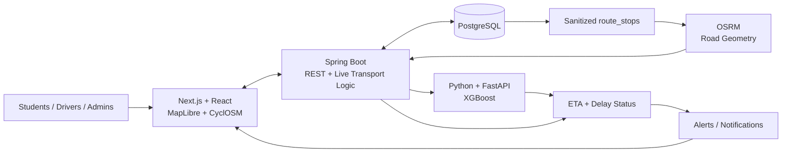

<div align="center">

# 🚌 <span style="color:#f97316">Campus</span><span style="color:#2563eb">Ride</span>
### Smart Campus Transport System

**Real-Time Tracking · Road-Aware ETA · ML-Powered Delay Prediction**


</div>

---

## ✦ What CampusRide Does

CampusRide turns live campus-bus movement into useful transport information for students and operators:

| Capability | What it does |
|---|---|
| **Live Tracking** | Tracks B01 using live/simulated telemetry and road-following movement. |
| **Smart ETA** | Calculates ETA from current bus position and remaining road distance. |
| **Delay Intelligence** | Uses an **XGBoost Regressor** to predict delay in minutes. |
| **Route Consistency** | Uses sanitized `route_stops` as the operational source of truth. |
| **Alerts** | Converts meaningful transport delays into student-facing notifications. |
| **Admin Operations** | Supports route/stop management and transport/ML monitoring. |

---

## ✦ The ML Core

The most important intelligence layer is our **XGBoost-based delay prediction pipeline**.

```text
┌─────────────────────┐
│ 🚌 Bus Telemetry    │
│ position · speed    │
│ route progress      │
└──────────┬──────────┘
           │
           ▼
┌─────────────────────┐
│ Feature Processing  │
└──────────┬──────────┘
           │
           ▼
┌─────────────────────┐
│ XGBoost Regressor   │
│ predicts delay(min) │
└──────────┬──────────┘
           │
           ▼
┌─────────────────────┐
│ ETA + Schedule      │
│ Comparison          │
└──────────┬──────────┘
           │
           ▼
┌─────────────────────┐
│ EARLY / ON TIME /   │
│ DELAYED             │
└──────────┬──────────┘
           │
           ▼
┌─────────────────────┐
│ Student Alerts + UI │
└─────────────────────┘
```

### Why XGBoost?

Our target is a **continuous delay value**, so this is a regression problem. XGBoost is used to learn non-linear relationships in transport data and produce a predicted delay in minutes.

> **ML predicts delay. OSRM determines the road.**

---

## ✦ System Architecture



---

## ✦ End-to-End Flow

**Telemetry → Validation → Sanitized Route Stops → OSRM Road Path → Bus Progress → Road-Distance ETA → ML Delay Prediction → Status → Alert → Student UI**

The important separation is deliberate:

- **PostgreSQL / `route_stops`** = canonical transport data
- **OSRM** = road-following geometry
- **XGBoost** = predicted delay
- **Spring Boot** = orchestration and business logic
- **Next.js** = live student/admin experience

---

## ✦ Technology Stack

| Layer | Technology |
|---|---|
| Frontend | Next.js · React · TypeScript |
| Maps | MapLibre · CyclOSM / OpenStreetMap |
| Routing | OSRM |
| Backend | Spring Boot · Java |
| Database | PostgreSQL |
| ML | Python · FastAPI · XGBoost |
| Live Data | GPS telemetry · WebSocket / REST |

---

<div align="center">

### 🚌 Real Data. Smarter Predictions. Safer Campuses.

**CampusRide — Smart Campus Transport System**

</div>
